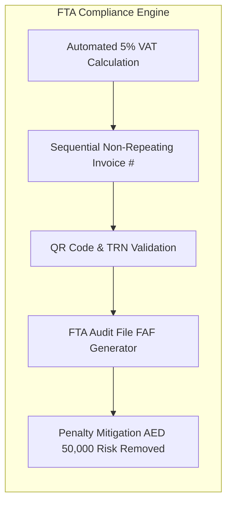

## Legal & Regulatory Framework

All five retail stores operate under **UAE Federal Decree-Law No. 8 of 2017 on Value Added Tax** and its Executive Regulations. The retail system is architected to guarantee continuous compliance, eliminating the risk of severe financial penalties administered by the Federal Tax Authority (FTA).

---

## 1. Mandatory Tax Invoice Specifications

Under FTA Executive Regulations (Article 59), each receipt printed or digitally emailed to customers must satisfy statutory Tax Invoice standards:

1. **Title**: The document must prominently state **"Tax Invoice"** (or **"Simplified Tax Invoice"** for retail sales up to AED 10,000).
2. **Supplier Identification**: Registered business name, trade license number, and the company's 15-digit **Tax Registration Number (TRN)**.
3. **Sequential Identifier**: An unbroken, sequential invoice number unique across the store network:
   - Format: `INV-[BRANCH_CODE]-[YEAR]-[SEQUENCE_NUMBER]` (e.g., `INV-DM01-2026-0004921`).
4. **Line-Item Tax Breakdown**:
   - Gross item price.
   - 5.0% VAT amount per line item.
   - Total VAT payable in UAE Dirhams (AED).
   - Total invoice consideration inclusive of VAT.
5. **QR Code Verification**: High-density QR code embedding the seller's name, TRN, invoice timestamp, total invoice amount, and total VAT amount for instant scanning by FTA inspection apps.

---

## 2. Federal Tax Authority Audit File (FAF) Export

When requested by the FTA for compliance auditing, registered entities must provide the official **FTA Audit File (FAF)** within 20 business days of notice.

The platform provides an automated export generating compliant FAF records across all five branches:

- **Format**: Standardized CSV / ASCII text structure.
- **Data Attributes Recorded**:
  - Purchase and sales transactional ledgers.
  - Line-by-line item descriptions and customs codes.
  - Customer TRN (for B2B sales).
  - Calculated VAT liability and tax exemption codes (if zero-rated export).
- **Audit Preparedness**: Generates reconciled quarterly tax returns, matching the FTA Form VAT201 filing report with a single click.
