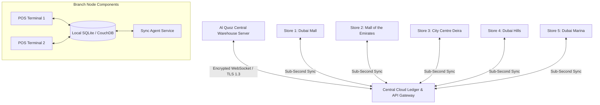
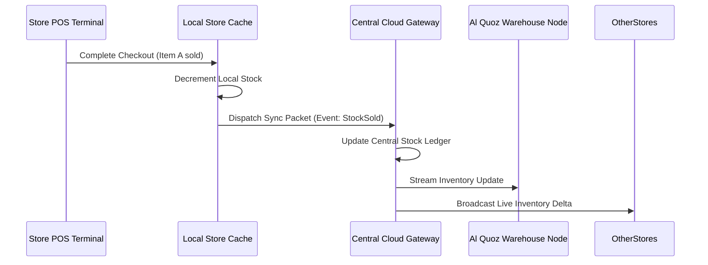

## Network Architecture Overview

The system architecture connects the **five retail branch nodes** with the **central warehouse node at Al Quoz** using a hybrid hub-and-spoke topology designed for high availability and offline operational resilience.

---

## 1. Local-First Resilience (Offline Capability)

Retail stores cannot tolerate point-of-sale interruptions due to intermittent internet connectivity:

- **Local Embedded Database**: Each branch maintains a localized, synchronized replica of active SKU catalogs, prices, promotions, and customer indexes using an embedded database.
- **Continuous Checkout**: If the broadband connection between the branch and the cloud gateway drops:
  1. The checkout terminal transitions seamlessly to **Offline Mode**.
  2. Cash, card, and barcode scanning continue operating normally.
  3. Transactions are cryptographically signed and stored in a secure local transaction journal.
  4. The UI displays an ambient offline warning badge to inform store supervisors.

---

## 2. Synchronization & Conflict Resolution Protocol

Upon reconnection, the localized Sync Agent establishes a secure TLS 1.3 session with the cloud API gateway and executes bidirectional state synchronization:

### Conflict Resolution Strategy
When simultaneous transactions occur across branches for low-quantity inventory:
- **Timestamp Ordering**: Transactions utilize monotonically increasing, NTP-synchronized vectors to order concurrent operations.
- **Safety Threshold Reservation**: The system maintains a 2-unit safety buffer per SKU. When stock drops to `<= 2`, cross-branch remote selling requires an active cloud handshake to prevent accidental double-sales.
