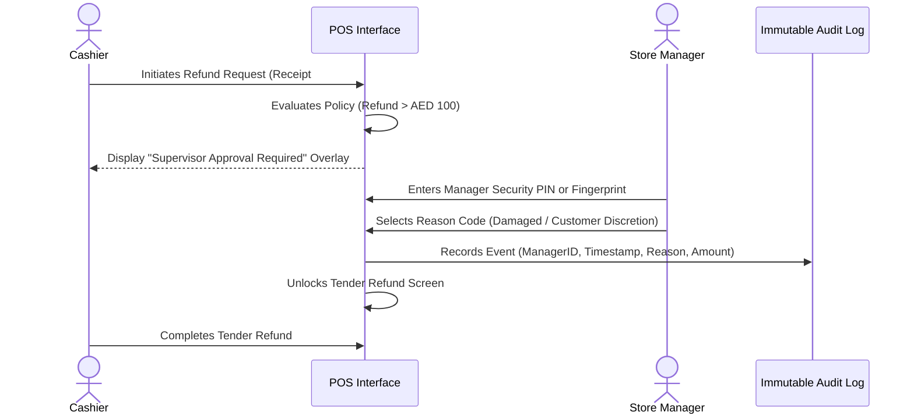

## Security Architecture & Separation of Duties

The system enforces strict **Separation of Duties (SoD)** through a granular Role-Based Access Control (RBAC) model. All access requires multi-factor or PIN authentication, and privileged actions mandate supervisor sign-off.

---

## Role-Based Access Control (RBAC) Matrix

| System Action / Operation | Cashier | Store Supervisor | Store Manager | Warehouse Coordinator | Finance Admin |
| :--- | :---: | :---: | :---: | :---: | :---: |
| Scan Items & Process Sale | ✅ | ✅ | ✅ | ❌ | ❌ |
| Accept Cash, Card, Split Tenders | ✅ | ✅ | ✅ | ❌ | ❌ |
| Apply Pre-Programmed Discounts | ✅ | ✅ | ✅ | ❌ | ❌ |
| Custom Price Override | ❌ | ⚠️ (Requires Approval) | ✅ | ❌ | ❌ |
| Void Active Item Line | ❌ | ✅ | ✅ | ❌ | ❌ |
| Cancel Entire Transaction | ❌ | ✅ | ✅ | ❌ | ❌ |
| Issue Cash / Card Refund | ❌ | ⚠️ (Requires Approval) | ✅ | ❌ | ❌ |
| Issue Store Credit Voucher | ✅ | ✅ | ✅ | ❌ | ❌ |
| Open / Reconcile Cash Float | ✅ | ✅ | ✅ | ❌ | ❌ |
| Request Al Quoz Stock Transfer | ❌ | ✅ | ✅ | ❌ | ❌ |
| Receive & Inspect Warehouse Shipment | ❌ | ✅ | ✅ | ✅ | ❌ |
| View Financial & Margin Reports | ❌ | ⚠️ (Store Only) | ✅ (Store Only) | ❌ | ✅ (All Stores) |
| Generate UAE FTA Audit Files (FAF) | ❌ | ❌ | ❌ | ❌ | ✅ |

*Legend: ✅ = Permitted | ⚠️ = Requires Dual-Auth Override | ❌ = Access Prohibited*

---

## Manager Approval & Override Workflows

Privileged actions (such as returns, line voids, and custom price adjustments) trigger an inline modal overlay preventing the cashier from continuing without manager authorization.

### Audit Trail & Forensics
Every override event is recorded with:
1. Approving Manager User ID.
2. Initiating Cashier User ID.
3. Precise ISO 8601 Timestamp.
4. Terminal Hardware Identifier and Branch ID.
5. Standardized Return/Void Reason Code.
6. Cryptographic SHA-256 hash linking the log entry to the subsequent financial transaction ledger.
