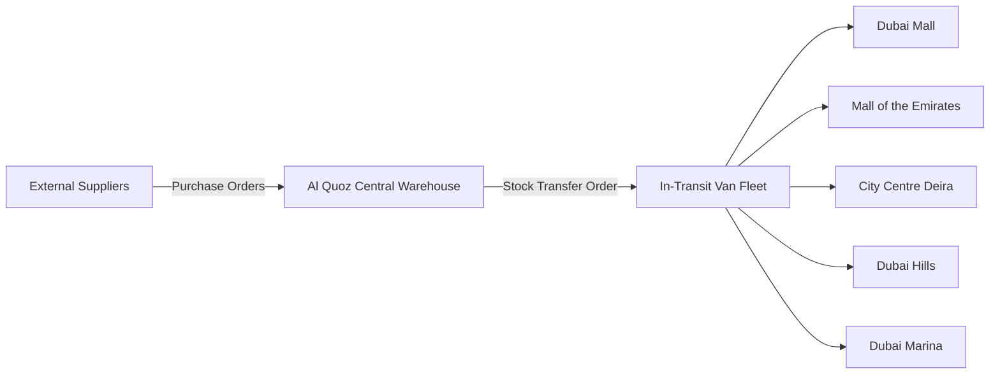

## Warehouse & Inventory Operations

The centralized **Al Quoz Distribution Hub** serves as the primary receiving, storage, and cross-docking center for the retail chain. 

---

## 1. Stock Transfer Request (STR) Workflow

When a retail branch requires replenishment from Al Quoz (or when reorder thresholds trigger automatically):

<Steps>
  <Step>
    ### Transfer Initiation
    The Store Supervisor reviews auto-generated reorder suggestions and clicks **"Submit Transfer Request"**. The request enters the Al Quoz fulfillment queue with priority ranking.
  </Step>

  <Step>
    ### Warehouse Picking & Dispatch
    Al Quoz staff receive the digital pick-list on rugged handheld scanners. Each item barcode is scanned during carton packing. When the pallet is verified, the system prints a **Manifest Bill of Lading** and status changes to `IN_TRANSIT`.
  </Step>

  <Step>
    ### Branch Receiving & Scan Audit
    Upon delivery by company logistics vans:
    - The receiving cashier scans each delivered SKU barcode against the digital manifest.
    - If delivered quantities match the manifest: status changes to `RECEIVED_VERIFIED` and branch inventory increments immediately.
    - **Discrepancy Protocol**: If any item is missing or damaged, the system prompts for a photo upload and logs a `TRANSFER_VARIANCE` incident for warehouse supervisor review.
  </Step>
</Steps>

---

## 2. Reducing Inventory Discrepancy from 10% to Under 0.5%

| Operational Cause of Legacy 10% Variance | Modernized Platform Remediation |
| :--- | :--- |
| **Batch 24-hr Lag**: Sales not reflected until midnight close. | **Real-Time Event Streaming**: Stock decrescents occur immediately upon receipt printing. |
| **Untracked Damaged Goods**: Cashiers tossing damaged goods without logging. | **Scanned Waste Logs**: Damaged stock must be scanned with manager sign-off. |
| **Unverified Van Transfers**: Stock assumed received without line-item verification. | **Barcode Scan Verification**: Receiving store must scan every carton before ledger moves. |
| **Annual Inventory Audits Only**: Inaccuracies compound over months. | **Rolling Cycle Counts**: System prompts daily 10-SKU spot counts per branch. |
