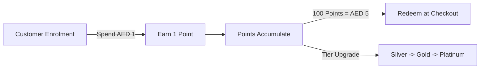

## Customer Loyalty Operations

The loyalty program is architected to eliminate customer churn, drive repeat purchases, and centralize customer transaction history across all 5 retail branches.



---

## 1. Quick Enrolment Workflow

During checkout at any register:
1. Cashier asks: *"Would you like to earn reward points on your purchase today?"*
2. Cashier clicks **"Quick Enrol"** on the POS interface.
3. Cashier enters the customer's UAE mobile number (`+971 5X XXX XXXX`) and First Name.
4. **Instant Welcome SMS**: The customer receives an immediate welcome SMS with their membership ID and a link to view their digital card in Apple Wallet or Google Wallet.
5. The ongoing transaction is immediately credited with loyalty points.

---

## 2. Points Accrual & Tier Structure

```text
Points Earned = Floor(Invoice Total in AED * Tier Multiplier)
```

| Loyalty Tier | Annual Spend Requirement | Earning Multiplier | Bonus Benefits & Privileges |
| :--- | :--- | :---: | :--- |
| **Silver** | Entry tier (AED 0 – AED 2,500) | **1.0x** (1 pt / AED 1) | Standard reward redemptions. |
| **Gold** | AED 2,501 – AED 7,500 | **1.25x** (1.25 pts / AED 1) | Free home delivery from Al Quoz, early sale access. |
| **Platinum** | Over AED 7,500 | **1.5x** (1.5 pts / AED 1) | Dedicated VIP support, extended 2-year warranty coverage. |

### Points Redemption Rules
- **Redemption Rate**: 100 points = **AED 5.00** discount against any purchase.
- **Minimum Threshold**: Minimum 100 points required to initiate redemption.
- **Security Validation**: Redemptions exceeding 500 points (AED 25.00) trigger a one-time OTP SMS confirmation sent to the customer's mobile phone.

---

## 3. Serial Number Tracking & Warranty Claims Lookup

Every high-value product or electronic item requires a manufacturer serial number or IMEI scan at checkout.

### Digital Warranty Registration
When the item is rung up:
1. The POS captures the serial number.
2. The central warranty database records:
   - Product SKU and Model description.
   - Serial Number / IMEI.
   - Purchase Date and Store Location.
   - Customer Mobile Number and Name.
   - Warranty Expiration Date (e.g., 24 months from purchase).

### Warranty Claims & RMA Lookup
If a customer returns to any of the 5 branches with a malfunctioning product:
- **No Paper Receipt Needed**: The cashier asks for the product serial number or the customer's phone number.
- **Instant Record Retrieval**: The system displays the original invoice, purchase date, warranty status, and service history.
- **Repair Order Dispatch**: If valid, the POS generates a Return Merchandise Authorization (RMA) slip and schedules transport to the Al Quoz service department.
