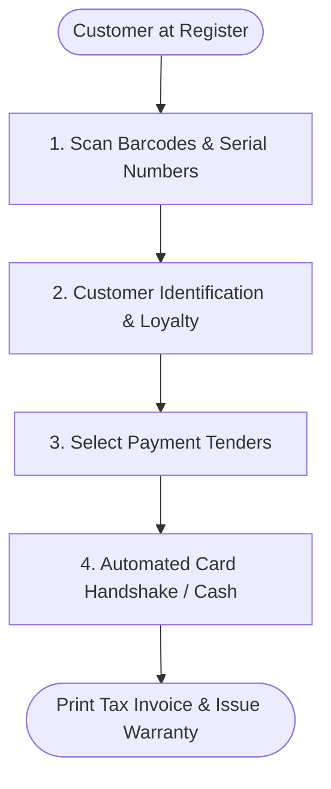

## Checkout Workflow Overview

The modernized Point-of-Sale interface replaces slow, error-prone manual steps with a streamlined **4-step checkout process** designed to complete transactions in under 30 seconds.

---

## Step-by-Step Checkout Process

<Steps>
  <Step>
    ### Step 1: Scan Merchandise & Capture Serial Numbers
    
    The cashier scans product barcodes using the 2D omnidirectional scanner.
    - If the item is classified as high-value or electronics (e.g., smart watches, tablets, luxury leather goods), the POS interface automatically prompts:
      > *"Please scan or enter the 12-digit manufacturer serial number / IMEI."*
    - The serial number is validated against the active warehouse manifest and bound to this sale.
  </Step>

  <Step>
    ### Step 2: Customer Loyalty Lookup
    
    The cashier prompts the customer for their UAE mobile number:
    - **Existing Member**: The customer's profile instantly loads showing their current tier (e.g., *Gold Member*), available points balance (e.g., *850 points = AED 42.50*), and applicable membership discount.
    - **New Member**: The cashier clicks **"Quick Enroll"**, inputs their mobile number and first name (takes under 15 seconds), and the customer is instantly enrolled.
  </Step>

  <Step>
    ### Step 3: Choose Payment Tender (Including Split Tenders)
    
    The total invoice sum (inclusive of 5% UAE VAT) is displayed. The customer selects their payment method:
    - **Single Payment**: Select **Card**, **Cash**, or **Store Credit**.
    - **Split Tender**: The cashier can divide the balance:
      1. Apply **AED 50** in Store Credit Voucher.
      2. Pay **AED 100** in Cash (system computes change due).
      3. Charge remaining **AED 320** to Bank Card.
  </Step>

  <Step>
    ### Step 4: Automated Terminal Handshake & Receipt Issuance
    
    When Card is selected:
    - The POS sends the exact charge amount directly to the bank terminal via local network API.
    - The terminal wakes up displaying `Please Tap, Insert, or Swipe Card: AED 320.00`.
    - Customer completes payment via Apple Pay, Google Pay, or Chip & PIN.
    - The terminal sends a digital `AUTHORIZATION_APPROVED` callback to the POS with the card authorization code.
    - The cash drawer opens if change is due, and the FTA-compliant Tax Invoice prints with embedded warranty details.
  </Step>
</Steps>
