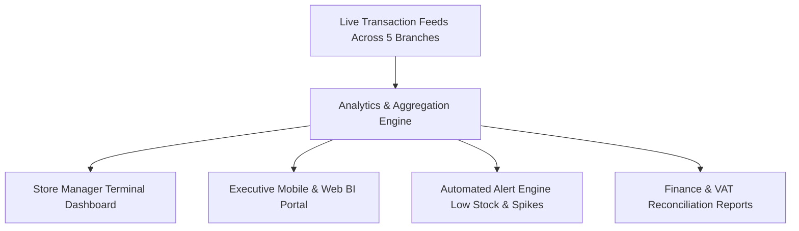

## Real-Time Reporting Suite

The reporting module bridges the gap between store-level transactional activity and executive management, replacing manual paper summaries with automated, real-time analytics.



---

## 1. Executive & Store Manager Dashboards

### Real-Time Performance Metrics
- **Live Gross Revenue**: Aggregate and branch-specific sales figures updated every 3 seconds.
- **Average Basket Size & Units Per Transaction (UPT)**: Real-time basket analytics indicating upselling efficacy.
- **Hourly Sales Velocity**: Visual heatmaps highlighting peak customer traffic periods (e.g., Friday 6:00 PM – 10:00 PM) to optimize staff scheduling.
- **Comparative Store Leaderboard**: Side-by-side performance comparison across the five branches:
  - Dubai Mall
  - Mall of the Emirates
  - City Centre Deira
  - Dubai Hills Mall
  - Dubai Marina Mall

---

## 2. Automated Inventory & Low-Stock Alerts

Store managers and the Al Quoz warehouse supervisor receive instant automated alerts based on live consumption rates:

<Callout type="warn" title="Low-Stock Trigger Mechanism">
  ```text
  Reorder Trigger Point = (Average Daily Demand * Lead Time from Al Quoz) + Safety Buffer
  ```
  When branch on-hand inventory reaches this threshold, the system displays a priority visual alert on the manager dashboard and automatically generates a draft Stock Transfer Order (STO).
</Callout>

### Alert Types & Delivery Channels
1. **Critical Out-of-Stock Alert**: Immediate push notification to store manager when high-velocity items reach zero inventory.
2. **Slow-Moving Inventory Warning**: Flags items with zero sales over 45 days, suggesting promotional markdown or transfer to higher-traffic branches.
3. **Discrepancy Spike Alert**: Triggers an alert to the Al Quoz inventory controller if physical cycle counts deviate from the system ledger by `> 1.0%`.

---

## 3. Financial & Shift Reconciliation Reports

### Automated End-of-Day (Z-Report)
At the end of trading, the system automatically compiles the **Z-Report** for each terminal:
- **Tender Breakdown**: Total Cash, Total Credit/Debit Card (verified against payment gateway auth totals), Total Store Credit, and Total Loyalty Points Redeemed.
- **Cash Drawer Reconciliation**: Expected cash in drawer versus counted cash entered by cashier, highlighting any overage or shortage.
- **Tax Breakdown**: Total Net Sales, 5% UAE VAT Collected, and Gross Total.
- **Audit Signature**: SHA-256 digital signature timestamped and transmitted to the central cloud ledger.
