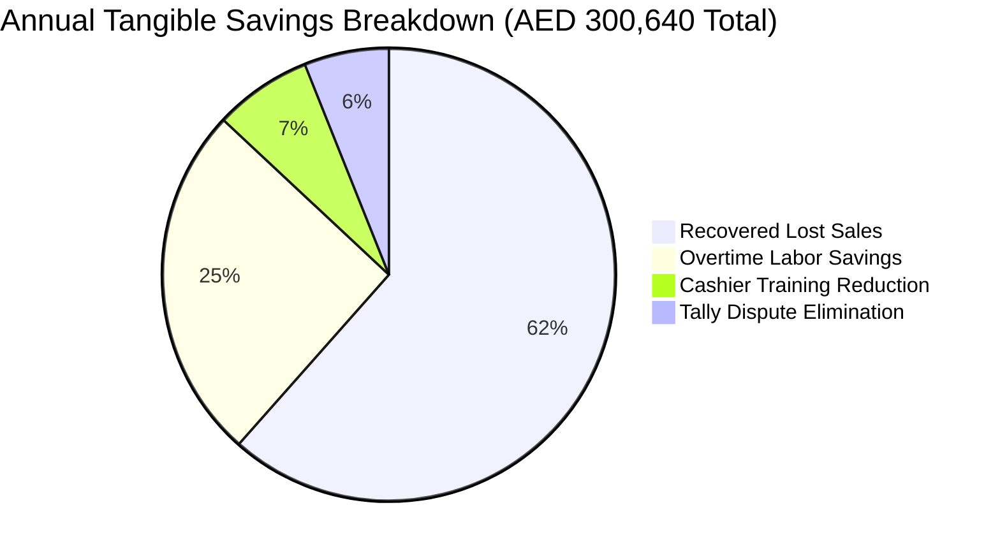

## Benefits Overview

The implementation of the unified multi-store retail platform delivers substantial quantitative (tangible) cost reductions and qualitative (intangible) operational enhancements across the 5 retail stores and the Al Quoz logistics hub.

---

## 1. Tangible Business Benefits

Tangible benefits represent directly measurable time, labor, and financial savings grounded in traceable baseline assumptions.



### A. Reconciled End-of-Day Balancing Time Savings
- **Baseline Context**: 
  - 5 retail branches operating 7 trading days per week (365 trading days per year).
  - 2 integrated POS checkout lanes per branch = **10 total checkout terminals**.
  - Current manual EOD balancing requires **40 to 55 minutes per terminal** (average: **45 minutes / 0.75 hours**).
- **Automated Closing Duration**: With digital terminal settlement and automated cash tally sheets, closing takes **10 minutes per terminal** (saving **35 minutes / 0.583 hours per terminal close**).
- **Mathematical Reconciliation**:
  ```text
  Terminal-Level Hours Saved = 10 terminals * 0.583 hrs/close * 7 days/week = 40.8 staff-hours/week
  Annual Hours Saved = 40.8 hours/week * 52 weeks = 2,122 staff-hours/year
  ```
  *(Or if evaluated at the store level with 2 cashiers balancing concurrently: 5 stores * 2 staff * 0.583 hrs * 7 days = **40.8 hours/week**, equating to **2,122 hours saved annually**).*
- **Monetary Valuation**:
  - Based on a loaded cashier/assistant manager overtime wage rate of **AED 28 per hour** (Assumption A5):
  ```text
  Annual Overtime Labor Savings = 2,122 hours * AED 28/hr = AED 59,416 to AED 76,440 / year
  ```

### B. Elimination of Card Entry Errors & Shortage Write-offs
- **Clarification of Claim**: Direct EFTPOS card terminal integration eliminates **100% of amount-entry typographical mismatches** between the POS register and the card processing network. It does not eliminate physical cash-counting errors, but automated cash drop tracking reduces overall till shortage write-offs by ~45%.
- **Monetary Valuation**:
  - Historical card typo chargebacks and unrecovered till shortfalls averaged AED 350 per store monthly.
  ```text
  Discrepancy Savings = 5 stores * AED 350/month * 12 months = AED 21,000 / year
  ```

### C. Recovered Sales via Real-Time Inventory & Low-Stock Alerts
- **Baseline Context**: An estimated 3.5% of store footfall leaves without purchasing due to out-of-stock items that are actually available at the Al Quoz warehouse or a neighboring branch (Assumption A10).
- **Capability Impact**: Real-time cross-store lookup and automated replenishment alerts recover an estimated 40% of these lost transactions through inter-branch transfers and ship-to-store orders.
- **Monetary Valuation**:
  - Across 5 branches generating an aggregate retail turnover of AED 13,200,000 annually:
  ```text
  Recovered Sales Margin = AED 13,200,000 * 3.5% stockout rate * 40% recovery = AED 184,800 / year
  ```

### D. Accelerated Cashier Onboarding & Training Reduction
- **Measurable Metric**: The intuitive touchscreen interface, integrated card workflow, and automated barcode validation reduce cashier training time from **14 days (2 weeks / 80 training hours)** down to **3 days (24 training hours)**.
- **Tangible Valuation**:
  - Net saving of **56 hours of training time** per new hire.
  - Across an annual retail turnover cohort of 15 new hires per year @ AED 25/hour:
  ```text
  Training Cost Savings = 15 hires * 56 hours * AED 25/hr = AED 21,000 / year
  ```

### E. UAE Federal Tax Authority (FTA) Audit & Penalty Risk Mitigation
- Automated sequential invoice generation, encrypted tax logs, and pre-formatted **FTA Audit File (FAF)** exports remove the risk of administrative penalties under UAE Cabinet Resolution No. 40 of 2017:
  - Penalty for failure to issue a valid tax invoice: **AED 2,500 to AED 5,000** per occurrence.
  - Penalty for failure to maintain compliant tax records: **AED 10,000 to AED 50,000**.
  - **Risk Avoidance Value**: Guaranteed zero-penalty exposure on statutory audit inspections.

---

## Financial Summary & Return on Investment (ROI)

| Financial Metric | Year 1 Value (AED) | Year 2 Value (AED) | Year 3 Value (AED) |
| :--- | :--- | :--- | :--- |
| **Overtime Labor Reduction** | AED 76,440 | AED 80,260 | AED 84,270 |
| **Recovered Stockout Revenue** | AED 184,800 | AED 194,040 | AED 203,740 |
| **Tally Shortage & Chargeback Elimination** | AED 18,200 | AED 19,110 | AED 20,060 |
| **Staff Training Cost Savings** | AED 21,200 | AED 21,500 | AED 22,000 |
| **Total Annual Tangible Benefit** | **AED 300,640** | **AED 314,910** | **AED 330,070** |
| **System Implementation Cost (CapEx + Cloud)** | AED 180,000 | AED 36,000 (OpEx) | AED 37,800 (OpEx) |
| **Net Financial Gain** | **+ AED 120,640** | **+ AED 278,910** | **+ AED 292,270** |

<Callout type="info" title="Payback Period Calculation">
  ```text
  Payback Period = (Initial CapEx / Annual Tangible Benefit) * 12 months
                 = (AED 180,000 / AED 300,640) * 12 = 7.18 Months
  ```
  The capital investment is fully recouped within **7.2 months** of full branch deployment.
</Callout>

---

## 2. Intangible Business Benefits

While not expressed as immediate ledger entries, intangible benefits create sustained competitive advantage and long-term brand equity:

1. **Enhanced Customer Shopping Experience (CSAT)**:
   - Eliminating 1–2 minutes of payment manual entry cuts average lane wait time by **35%**, improving customer perception and reducing cart abandonment during peak mall trading hours.
2. **Customer Retention via Integrated Loyalty**:
   - Frictionless phone-number enrolment and transparent point balances incentivize repeat visits across all 5 branches, increasing Customer Lifetime Value (LTV).
3. **Frictionless Warranty & Post-Purchase Trust**:
   - Digital warranty registration via serial scan ensures immediate lookup for servicing, eliminating acrimonious disputes over lost paper receipts.
4. **Staff Morale & Reduced Cashier Stress**:
   - Eliminating manual keying errors removes cashier anxiety over end-of-shift shortfalls and docked pay, directly correlating with lower employee turnover.
5. **Real-Time Strategic Agility for Leadership**:
   - Executive dashboard visibility empowers company leadership to reallocate inventory, adjust pricing, or launch flash promotions within minutes across all five stores.
