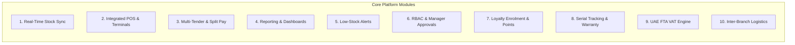

## Functional Overview

To resolve the operational bottlenecks identified in the Problem Statement, the new unified retail platform delivers **ten core system capabilities**. Each capability directly addresses an identified operational inefficiency and satisfies UAE regulatory standards.

---

## The Ten Core Capabilities

### Capability 1: Centralized Real-Time Inventory Synchronization
- **Description**: Sub-second synchronization engine connecting all 5 retail branch databases to the central Al Quoz warehouse ledger over secure web protocols.
- **Key Features**:
  - Live stock visibility across all stores (e.g., cashier at Dubai Mall can view real-time availability at Mall of the Emirates or Al Quoz).
  - Offline-resilient transaction queueing with automated conflict resolution upon network reconnection.
  - Automatic inventory decrement immediately upon checkout completion.

### Capability 2: Integrated EFTPOS Card Terminal Connectivity
- **Description**: Direct digital integration between the POS software and bank-certified payment terminals (e.g., PAX, Ingenico) via local network/IP protocol.
- **Key Features**:
  - Automated transmission of the exact purchase total directly to the card terminal screen (eliminates cashier manual re-typing).
  - Instant digital transaction handshake with auth-code verification recorded on the sales receipt.
  - Zero-touch settlement reconciliation comparing card acquirer batch totals with POS register records.

### Capability 3: Multi-Tender & Split-Payment Processing
- **Description**: Comprehensive tender handling with support for split payments across diverse payment instruments.
- **Clarification of Tender Types**:
  - **Cash**: Automated cash drawer trigger, change calculation, and float tracking.
  - **Debit / Credit Cards**: Visa, MasterCard, Apple Pay, Google Pay, and UnionPay via integrated terminal.
  - **Store Credit**: Digital customer wallet balance issued from previous returns or refunds.
  - **Gift Vouchers**: Alphanumeric barcode vouchers with one-time validation.
  - **Split Tenders**: Ability to combine payment methods on a single transaction (e.g., AED 100 in Cash + AED 250 on Card + AED 50 Store Credit).

### Capability 4: Live Sales Reporting & Executive Dashboards
- **Description**: Real-time business intelligence and reporting suite for store managers and company executives.
- **Key Features**:
  - Live multi-store revenue tracking, gross margin monitoring, and hourly transaction velocity.
  - Fast-moving vs. slow-moving product ranking.
  - Customizable reporting filters by store, category, cashier, payment method, and date range.
  - Export capabilities in Excel, CSV, and PDF formats for finance teams.

### Capability 5: Automated Low-Stock Alerts & Replenishment Reordering
- **Description**: Proactive inventory monitoring engine based on dynamic min/max stock thresholds.
- **Key Features**:
  - Configurable safety stock levels per SKU per retail location.
  - Automated SMS and dashboard alerts to store managers when stock breaches the reorder threshold.
  - Single-click Stock Transfer Request (STR) generation from the store directly into the Al Quoz warehouse fulfillment queue.

### Capability 6: Role-Based Access Control (RBAC) & Manager Approvals
- **Description**: Granular permissions hierarchy enforcing separation of duties and preventing unauthorized transactions.
- **Permission Matrix**:
  - **Cashier**: Standard sales, barcode scanning, customer search, receipt re-print.
  - **Supervisor / Store Manager**: Price overrides, voided lines, stock counts, shift open/close.
  - **Warehouse Coordinator**: Receiving goods, picking, bin allocation, dispatch to stores.
  - **System Admin / Finance**: Tax settings, user management, system audit logs, FTA exports.
- **Approval Workflow**:
  - Mandatory Manager PIN or biometric authorization required for any **refund, exchange, transaction cancellation, or discount exceeding 10%**.
  - Immutable audit trail recording timestamps, approving manager ID, and reason codes for all override events.

### Capability 7: Customer Enrolment & Tiered Loyalty Management
- **Description**: End-to-end customer relationship and rewards infrastructure across all touchpoints.
- **Key Features**:
  - **Frictionless Enrolment**: Cashiers can enroll walk-in customers in under 15 seconds using only their UAE mobile number (`+971 5X XXX XXXX`) and name.
  - **Points Accrual**: Automated reward calculation (e.g., 1 reward point per AED 1 spent).
  - **Redemption & Tiers**: Seamless point conversion to discounts at checkout (e.g., 100 points = AED 5 discount) with tier progression (Silver, Gold, Platinum).
  - **Unified Purchase History**: Customers can view receipts and warranty statuses across any branch.

### Capability 8: Item Serial Number Tracking & Automated Warranty Lookup
- **Description**: Mandatory serial/IMEI capture for warrantied electronics and high-value merchandise.
- **Key Features**:
  - Prompted barcode/serial scan during POS ring-up prior to tender completion.
  - Centralized warranty database logging sale date, serial number, warranty duration, and customer contact.
  - **Instant Warranty Lookup**: In the event of a customer repair or return, cashiers search by serial number or phone number—paper receipt not required.

### Capability 9: UAE FTA & VAT Compliance Engine
- **Description**: Certified tax accounting module compliant with UAE Federal Decree-Law No. 8 of 2017 and FTA regulations.
- **Key Features**:
  - Automatic 5% standard VAT calculation with separate tax breakdown lines on receipts.
  - Mandatory Tax Registration Number (TRN) validation for B2B corporate customers.
  - Standardized Tax Invoice numbering (sequential, uninterrupted, store-prefixed).
  - Single-click generation of the standardized **FTA Audit File (FAF)** in CSV/ASCII format for tax audit submissions.

### Capability 10: Multi-Location Warehouse Management & Stock Transfer Protocol
- **Description**: End-to-end logistics workflow coordinating inventory movements between the Al Quoz central warehouse and retail outlets.
- **Key Features**:
  - Digital Transfer Orders (TO) with tracking stages: *Requested -> Picked -> In-Transit -> Received & Reconciled*.
  - Discrepancy flagging: System alerts if receiving store counts differ from Al Quoz dispatch manifest.
  - Direct supplier PO receiving and quality inspection workflows at the Al Quoz facility.

---

## Capability-to-Problem Traceability Matrix

| Problem Identified in Legacy System | Solving System Capability |
| :--- | :--- |
| 10% inventory discrepancy between stores and warehouse | **Capability 1** (Real-Time Sync) & **Capability 10** (Stock Transfer Protocol) |
| Manual amount re-typing causing card tally errors | **Capability 2** (Integrated EFTPOS Connectivity) |
| Inability to accept store credit, gift cards, or split payments | **Capability 3** (Multi-Tender & Split-Payment Processing) |
| Branch managers lack live sales data & store visibility | **Capability 4** (Sales Reporting & Executive Dashboards) |
| Frequent stockouts due to delayed reordering | **Capability 5** (Automated Low-Stock Alerts & Replenishment) |
| Fraud risk from unverified refunds and discounts | **Capability 6** (RBAC & Mandatory Manager Approvals) |
| No customer retention mechanism & customer churn | **Capability 7** (Customer Enrolment & Tiered Loyalty Management) |
| Lost paper receipts causing warranty dispute friction | **Capability 8** (Serial Number Tracking & Warranty Lookup) |
| Exposure to UAE FTA audit fines and manual VAT accounting | **Capability 9** (UAE FTA & VAT Compliance Engine) |
