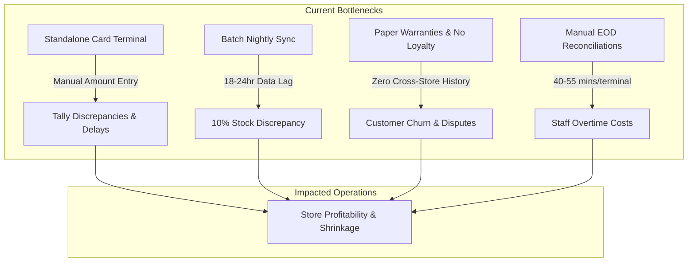

## Executive Overview

The business operates a retail chain comprising **five physical retail branches in Dubai** and a central distribution hub located in the **Al Quoz Industrial Area**. Currently, each retail store runs a decoupled, legacy Point-of-Sale (POS) installation that performs daily end-of-day batch synchronization with the centralized warehouse database. 

This disconnected architecture introduces severe data lag, inventory inaccuracies, delayed payment reconciliations, and regulatory compliance risks under UAE Federal Tax Authority (FTA) mandates.

<Callout type="info" title="Formal Problem Statement">
  **The problem of** delayed inventory synchronization, manual payment reconciliation, and fragmented customer data across five retail stores and the Al Quoz central warehouse **affects** store cashiers, branch managers, warehouse supervisors, finance personnel, and shoppers, **the impact of which is** an average 10% inventory discrepancy, 40–55 minutes of manual cash/card balancing per terminal each night, checkout queues extended by 1–2 minutes per customer, lost sales from unrecorded stockouts, and heightened exposure to FTA tax penalty audits.
</Callout>

---

## Detailed Problem Analysis

### 1. Disconnected Inventory & Data Lag
Under the current setup, inventory transactions made across the 5 retail outlets are queued locally and synchronized to the Al Quoz warehouse server only once every 24 hours at store closing. 
- **Stock Inaccuracy**: Store stock ledgers diverge from physical reality by an average of **10%** during active trading hours (Baseline Assumption B1).
- **Stockouts & Ghost Inventory**: Branch managers cannot view true real-time stock levels at sister branches or the Al Quoz warehouse. Cashiers frequently promise items to customers that have already been sold or allocated elsewhere, leading to customer frustration and cancelled orders.
- **Blind Replenishment**: The Al Quoz logistics team operates reactively rather than proactively, causing unnecessary rush deliveries and uneven stock distribution across high-traffic branches (e.g., Dubai Mall vs. Dubai Hills).

### 2. Standalone Payment Terminals & Checkout Friction
Card payments are handled on separate bank-provided electronic funds transfer (EFTPOS) terminals that are not digitally integrated with the checkout software.
- **Manual Dual-Entry**: Cashiers must manually re-type the total sale amount from the POS screen into the bank card machine keypad.
- **Keying Errors**: Typographical mistakes (e.g., entering AED 150 instead of AED 1,500, or vice versa) occur in approximately 1 out of every 65 transactions, requiring tedious post-transaction corrections.
- **Queue Delays**: Manual card entry and physical slip verification add **1 to 2 minutes** of friction per transaction (Baseline Assumption B2), multiplying checkout wait times during peak evening and weekend retail rushes.

### 3. Labor-Intensive End-of-Day (EOD) Balancing
At closing, cashiers and branch supervisors must manually reconcile paper register rolls, physical cash drawers, and standalone card merchant terminal batch summaries.
- **Time Drain**: Balancing requires **40 to 55 minutes per terminal** every night (Baseline Assumption B3).
- **Overtime Costs**: Across 10 active terminals (2 per branch across 5 branches), store supervisors accumulate substantial overtime expense every month purely on administrative tally audits.
- **Human Error & Auditing Friction**: Finding and tracing a AED 50 difference between bank settlement reports and POS till slips consumes hours of managerial time.

### 4. Absence of Customer Loyalty & Warranty Infrastructure
- **Customer Churn**: The current system treats every customer as an anonymous walk-in. There is no centralized mechanism to enroll members, accumulate reward points, or offer personalized tier discounts.
- **Warranty Disputes**: Electronics and durable goods with manufacturer warranties rely on stamped paper receipts. Customers who lose physical receipts face rejected claims, damaging brand goodwill and customer lifetime value (LTV).

### 5. Regulatory Compliance & Tax Auditing Risks
Under UAE Federal Decree-Law No. 8 of 2017 on Value Added Tax, businesses are legally obligated to issue valid tax invoices with accurate VAT breakdowns, sequential numbering, and the supplier's Tax Registration Number (TRN).
- Disconnected offline installations risk duplicate or skipped invoice sequence numbers during network re-connections.
- Producing an on-demand **FTA Audit File (FAF)** across five branches requires manual consolidation across multiple spreadsheet exports, creating significant non-compliance penalty exposure (up to AED 50,000 per violation under Cabinet Resolution No. 40 of 2017).

---

## Stakeholder Impact Matrix

| Stakeholder | Role in Retail Operations | Direct Operational Impact & Pain Points |
| :--- | :--- | :--- |
| **Store Cashiers** | Front-line till operations | Manual amount entry on card terminals, queue stress, memorizing SKU codes, tedious manual EOD cash counts. |
| **Branch Managers** | Store oversight & shift approvals | Blind inventory management, 45+ minutes spent on nightly tally balancing, manual authorization of returns without fraud prevention logs. |
| **Warehouse Supervisors (Al Quoz)** | Receiving, inventory & distribution | Receiving orders blind to store run rates, high discrepancy investigations, manual pick-pack errors. |
| **Finance & Compliance Officers** | Accounting & tax filing | Reconciling fragmented bank settlement files with store journals, compiling manual VAT reports, fear of FTA audit discrepancies. |
| **Retail Customers** | End consumer & loyalty member | Long queues (1–2 min delay per card swipe), unable to access loyalty rewards across branches, warranty claim friction. |
